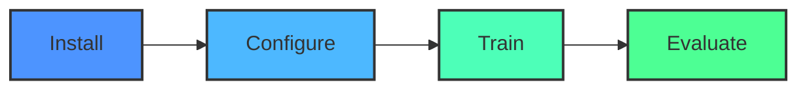

# 🎮 FlashRL - Chrome Dino RL 

<div align="center">
  
```
███████╗██╗      █████╗ ███████╗██╗  ██╗██████╗ ██╗     
██╔════╝██║     ██╔══██╗██╔════╝██║  ██║██╔══██╗██║     
█████╗  ██║     ███████║███████╗███████║██████╔╝██║     
██╔══╝  ██║     ██╔══██║╚════██║██╔══██║██╔══██╗██║     
██║     ███████╗██║  ██║███████║██║  ██║██║  ██║███████╗
╚═╝     ╚══════╝╚═╝  ╚═╝╚══════╝╚═╝  ╚═╝╚═╝  ╚═╝╚══════╝
```

  <p>
    <a href="https://www.python.org/"></a>
    <a href="https://www.tensorflow.org/"></a>
    <a href="https://developer.mozilla.org/en-US/docs/Web/JavaScript"></a>
  </p>
  
  <p>
    
    
    
    
  </p>
  
  <h3>🦖 A Deep Q-Learning agent that learns to master the Chrome Dino game using reinforcement learning 🦖</h3>
  <p><em>Created by <a href="https://github.com/Zburgers/">Zburgers</a></em></p>
</div>

```
             F L A S H R L  ·  Chrome Dino RL Agent
```

## 🧠 What is FlashRL?

FlashRL is a reinforcement learning project that trains an AI agent to play the Chrome Dino game (the game you get when Chrome has no internet connection). Using Deep Q-Networks (DQN), the agent learns to make decisions based on pixel data from the game screen, progressively improving its ability to avoid obstacles and achieve higher scores.

The project demonstrates practical application of:
- Deep Q-Learning
- Computer vision for game state detection
- Browser automation
- Neural networks for decision making

<div align="center">
  <table>
    <tr>
      <td align="center"><br />Screen Capture</td>
      <td align="center">➡️</td>
      <td align="center"><br />Neural Processing</td>
      <td align="center">➡️</td>
      <td align="center"><br />Game Action</td>
      <td align="center">➡️</td>
      <td align="center"><br />Learning</td>
    </tr>
  </table>
</div>

## 🚀 Quick Start



<div align="center">
  
  ```bash
  # Clone repository
  git clone https://github.com/Zburgers/FlashRL.git
  
  # Install dependencies
  pip install -r requirements.txt
  
  # Run the training script
  python train_agent.py
  
  # Test the trained agent
  python run_agent.py
  ```
</div>

## 📋 Requirements

- Python 3.8+
- Chrome browser
- Node.js (for JavaScript components)
- A dedicated GPU is recommended for faster training

## 🔧 Installation

1. **Clone the repository**
   ```bash
   git clone https://github.com/Zburgers/FlashRL.git
   cd FlashRL
   ```

2. **Create a virtual environment (recommended)**
   ```bash
   python -m venv venv
   
   # On Windows
   venv\Scripts\activate
   
   # On macOS/Linux
   source venv/bin/activate
   ```

3. **Install Python dependencies**
   ```bash
   pip install -r requirements.txt
   ```

4. **Install JavaScript dependencies**
   ```bash
   npm install
   ```

5. **Chrome Setup**
   - Make sure Chrome is installed
   - The script will automatically launch Chrome in debug mode

## 🎮 Running the Agent

### Training Mode

To train the agent from scratch:

```bash
python train_agent.py --episodes 1000 --batch-size 64 --memory-size 10000
```

Optional arguments:
- `--episodes`: Number of training episodes (default: 1000)
- `--batch-size`: Batch size for training (default: 64)
- `--memory-size`: Size of replay memory (default: 10000)
- `--epsilon`: Starting exploration rate (default: 1.0)
- `--epsilon-min`: Minimum exploration rate (default: 0.01)
- `--epsilon-decay`: Decay rate for exploration (default: 0.995)
- `--gamma`: Discount factor (default: 0.99)
- `--learning-rate`: Learning rate for the neural network (default: 0.001)

### Testing Mode

To run a pre-trained agent:

```bash
python run_agent.py --model models/dino_dqn_latest.h5
```

Optional arguments:
- `--model`: Path to trained model file (default: models/dino_dqn_latest.h5)
- `--render`: Display game window (default: True)
- `--fps`: Target frames per second (default: 30)

### Web Interface

To use the web-based visualizer:

```bash
python server.py
```

Then open your browser at http://localhost:8000 to view the agent's performance metrics and visualizations.

## 🧩 Project Structure

```
FlashRL/
├── agent/                  # Agent implementation
│   ├── dqn_agent.py        # Deep Q-Network agent
│   └── replay_memory.py    # Experience replay implementation
├── environment/            # Game environment
│   ├── dino_env.py         # Chrome Dino game environment wrapper
│   └── screen_capture.py   # Screen capture utilities
├── models/                 # Saved model files
│   └── dino_dqn_latest.h5  # Latest trained model
├── utils/                  # Utility functions
│   ├── preprocessing.py    # Image preprocessing
│   └── visualization.py    # Training visualization
├── web/                    # Web interface
│   ├── index.html          # Dashboard
│   ├── js/                 # JavaScript files
│   └── css/                # Stylesheets
├── train_agent.py          # Main training script
├── run_agent.py            # Script to run a trained agent
├── server.py               # Web server for visualization
├── requirements.txt        # Python dependencies
└── package.json            # JavaScript dependencies
```

## 🔄 How It Works

FlashRL uses a combination of:

1. **Screen Capture**: Grabs frames from the Chrome Dino game
2. **Preprocessing**: Converts raw pixels to a suitable input format
3. **Deep Q-Network**: Neural network that learns optimal actions
4. **Reward System**: Provides feedback based on game performance
5. **Experience Replay**: Stores and reuses past experiences to improve learning

### The Deep Q-Network Architecture

```
Input Layer (Game Screen) → Convolutional Layers → Flatten → Dense Layers → Output (Action Values)
```

The network predicts the value of each possible action (jump, duck, do nothing) given the current game state.

## 📈 Performance

After sufficient training, the agent typically achieves:
- Average Score: 500+ points
- Survival Time: 45+ seconds
- Learned Behaviors: Timing jumps, ducking under birds, adapting to speed changes

## 🔍 Debugging

If you encounter issues:

1. **Browser Connection Problems**
   ```bash
   python utils/test_chrome_connection.py
   ```

2. **Screen Capture Issues**
   ```bash
   python utils/test_screen_capture.py
   ```

3. **Common errors and solutions**
   - "Chrome not found": Ensure Chrome is installed and the path is correct
   - "No display detected": Make sure you have a graphical environment or use a virtual display
   - "CUDA out of memory": Reduce batch size or model complexity

## 🛠️ Advanced Configuration

### Custom Neural Network Architecture

You can modify the network architecture in `agent/dqn_agent.py`:

```python
def build_model(self):
    model = Sequential()
    model.add(Conv2D(32, (8, 8), strides=4, padding='valid', input_shape=self.state_shape))
    model.add(Activation('relu'))
    # Add or modify layers here
    model.add(Dense(self.action_size))
    model.compile(loss='mse', optimizer=Adam(lr=self.learning_rate))
    return model
```

### Environment Parameters

Modify game parameters in `environment/dino_env.py`:

```python
# Adjust reward function
def calculate_reward(self, score, game_over):
    if game_over:
        return -10  # Penalty for dying
    elif score > self.last_score:
        return 1  # Reward for increasing score
    return 0.1  # Small reward for surviving
```

## 👥 Contributing

We welcome contributions to FlashRL! Here's how you can help:

1. **Improve the agent**: Implement new algorithms or optimize the current DQN
2. **Enhance visualization**: Add more metrics or improve the web dashboard
3. **Optimize performance**: Make the training process faster or more efficient
4. **Documentation**: Improve the documentation or add tutorials

Please see [CONTRIBUTING.md](CONTRIBUTING.md) for details on our code of conduct and submission process.

## 📊 Results Visualization

<div align="center">
  <table>
    <tr>
      <td></td>
      <td></td>
    </tr>
    <tr>
      <td></td>
      <td></td>
    </tr>
  </table>
</div>

## 📝 Citation

If you use this project in your research, please cite:

```
@software{FlashRL,
  author = {Zburgers},
  title = {FlashRL: Deep Q-Learning Agent for Chrome Dino},
  year = {2023},
  url = {https://github.com/Zburgers/FlashRL}
}
```

## 📜 License

This project is licensed under the MIT License - see the [LICENSE](LICENSE) file for details.

## 👨‍💻 About the Creator

<div align="center">
  
  <h3>Zburgers</h3>
  <p>FlashRL was developed by Zburgers as a demonstration of reinforcement learning applied to browser-based games.</p>
  
  <div>
    <a href="https://github.com/Zburgers/" target="_blank">
      
    </a>
  </div>
</div>

## 🙏 Acknowledgments

- The Chrome Dino game created by Google
- OpenAI for their research on Deep Q-Learning
- The TensorFlow and PyTorch communities
- All contributors and testers

---

<div align="center">
  <p>Made with ❤️ and 🧠 by <a href="https://github.com/Zburgers/">Zburgers</a></p>
  
  <a href="https://github.com/Zburgers/FlashRL/stargazers">⭐ Star this project ⭐</a>
</div>
