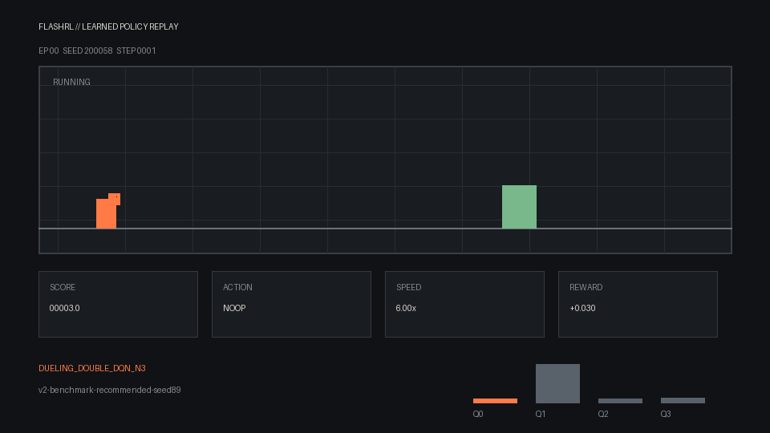

# FlashRL

[](https://github.com/Zburgers/FlashRL/actions/workflows/ci.yml)
[](https://www.python.org/)
[](LICENSE)

FlashRL is a compact reinforcement-learning research benchmark built around a
deterministic Dino runner. It combines correct DQN semantics, exact frame-budget
experiments, held-out multi-seed evaluation, traceable artifacts, and a live
policy laboratory that exposes what the learned network is doing.

FlashRL V2 is deliberately simulator-only. That makes every trajectory
reproducible in CI and keeps the research claims honest.



## Result

The selected Dueling Double DQN with three-step returns was trained for exactly
120,000 frames on each of five independent seeds. Every policy was evaluated
greedily on the same 100 unseen episode seeds.

| Policy | Train runs | Eval episodes | Mean score | 95% CI across train seeds |
| --- | ---: | ---: | ---: | ---: |
| **Learned DQN** | **5** | **500** | **301.90** | **[270.61, 335.98]** |
| Rule controller | 1 | 100 | 284.17 | deterministic policy |
| Random | 1 | 100 | 126.18 | fixed action RNG |

The learned aggregate is 139.3% above random. Its point estimate is 6.2% above
the rule controller, but rule performance lies inside the learned
training-seed interval, so FlashRL does not claim a reliable advantage over the
hand-engineered controller.

[Read the benchmark report](reports/v2_benchmark_report.md) ·
[inspect per-run data](reports/v2_benchmark_runs.csv) ·
[review the ablation study](reports/v2_pilot_report.md) ·
[compare DQN components](reports/v2_component_report.md)


## Quick start

```bash
git clone https://github.com/Zburgers/FlashRL.git
cd FlashRL
python -m venv .venv
source .venv/bin/activate
pip install -e ".[dev]"
python scripts/smoke_test.py
pytest -q
```

Launch the live laboratory immediately with the built-in rule policy:

```bash
flashrl demo
```

For the learned-policy experience, download the representative V2 release
checkpoint and launch it:

```bash
curl -L \
  https://github.com/Zburgers/FlashRL/releases/download/v2.0.0/flashrl-v2-demo-best.pt \
  -o best.pt
flashrl demo --policy dqn --checkpoint best.pt --seed 200058
```

The local interface animates the real simulator state and displays score,
reward, action, speed, survival time, all Q-values, selected action, training
run identity, checkpoint role, and frame count. It also supports pause, playback
speed, and deterministic seed resets.

Record a portable replay without opening a browser:

```bash
flashrl demo \
  --policy dqn \
  --checkpoint best.pt \
  --seed 200058 \
  --record reports/demo/reproduction.gif
```

## Reproduce the research

Inspect the six-component pilot matrix:

```bash
flashrl experiment experiments/pilot.yaml --dry-run
```

Run or safely continue the final benchmark:

```bash
flashrl experiment experiments/v2_benchmark.yaml --resume
```

Regenerate the Markdown report, publication CSVs, and dependency-free SVG
figures from finalized run manifests:

```bash
flashrl analyze runs/v2-benchmark \
  --out reports/v2_benchmark_report.md \
  --publish-data reports
```

Each learned job writes:

```text
runs/v2-benchmark/<run-id>/
├── manifest.json
├── config.json
├── train_metrics.csv
├── eval_results.csv
├── eval_results.jsonl
├── best.pt
└── last.pt
```

`best.pt` is selected on a fixed seed set separate from final evaluation.
`last.pt` retains optimizer and RNG state for continuation. Writes are atomic,
and checkpoint loading rejects incompatible environment or schema versions.

## Experiment with DQN

Train a small custom run:

```bash
flashrl train \
  --episodes 10000 \
  --total-train-frames 30000 \
  --seed 7 \
  --learning-rate 0.0005 \
  --n-step 3 \
  --output-dir runs
```

Evaluate its selected checkpoint:

```bash
flashrl evaluate \
  --agent dqn \
  --checkpoint runs/<run-id>/best.pt \
  --episodes 100 \
  --eval-seed 300000 \
  --out results/evaluation.csv
```

The implementation keeps vanilla DQN, Double Q-learning, dueling heads,
prioritized replay, and N-step returns independently selectable. The pilot
found three-step targets to be the robust gain; prioritized replay did not
survive the equal-budget follow-up.

A fresh five-seed component benchmark replicated that result at an equal
30,000-frame budget: recommended N3 scored 289.67, Dueling Double 255.79,
vanilla 238.68, and Double DQN 199.37, with 100 held-out episodes per trained
policy.

## Supported surface

- Gymnasium environment ID `FlashRL-DinoSim-v2`
- state, vision, and hybrid simulator observations
- minimal and full discrete action schemas
- MLP, CNN, and hybrid Q-networks
- vanilla, Double, Dueling Double, PER, and N-step DQN components
- terminal-safe and time-limit-safe TD targets
- deterministic uniform and prioritized replay sampling
- exact frame budgets and resumable experiment matrices
- versioned manifests, checkpoints, and per-episode results
- two-level run-first aggregation with bootstrap intervals
- local live demo and deterministic GIF recording
- Python 3.10 through 3.13 CI and installed-wheel qualification

PPO and real-browser transfer are research directions, not V2 features.

## More

- [Technical research report](REPORT.md)
- [Benchmark protocol](docs/benchmark_protocol.md)
- [Environment API](docs/environment_api.md)
- [Experiment configuration guide](experiments/README.md)
- [Contributing](CONTRIBUTING.md)
- [V1 history and invalid-artifact rationale](docs/history/v1.md)
