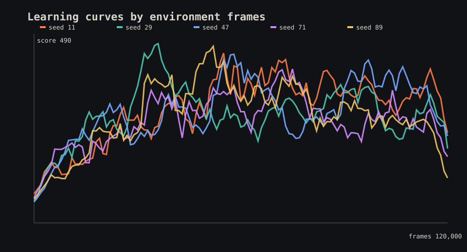

# FlashRL V2 Technical Report

Date: 2026-07-28

## Abstract

FlashRL V2 studies value-based reinforcement learning in a deterministic Dino
runner. The work first repaired environment observability, termination targets,
N-step discounts, experiment identity, checkpoint selection, and aggregation.
It then evaluated six DQN component combinations, followed promising results
with two exact-frame-budget tuning studies, and locked a final protocol before
running five independent training seeds on a new held-out episode set.

The final Dueling Double DQN with three-step returns scores **301.90** averaged
across five trained policies and 500 held-out episodes. Its 95% bootstrap
interval across training-run means is **[270.61, 335.98]**. Random scores
126.18 and the hand-coded rule controller scores 284.17 on the exact same 100
episode seeds. The learned result reliably clears the project’s random-policy
gate. Its aggregate exceeds rule by 6.2%, but rule lies inside the learned
training-seed interval, so a reliable rule-policy advantage is not claimed.

## Research question

Can a small, reproducible DQN implementation learn a Dino policy that
generalizes to held-out obstacle sequences, and which common DQN components
improve performance under controlled sample budgets?

The preregistered release gate was stronger than producing one attractive
episode: a selected configuration had to beat random across at least five
independent training seeds and at least 100 held-out episodes per policy.

## Environment

`FlashRL-DinoSim-v2` is a deterministic, Gymnasium-compatible simulator with a
fixed 50 ms timestep. The full policy has four actions: no-op, jump press, duck
press, and release. Reward is:

```text
0.01 * score_delta + obstacles_cleared - 10 * crashed
```

The final policy observes 12 bounded state features: Dino altitude and vertical
velocity, jump and duck state, speed, nearest-obstacle distance, dimensions,
type and altitude, plus second-obstacle distance. Bird bottom and top were added
in V2 because type and height alone alias low birds that require ducking with
high birds that are safe.

A crash is a true MDP termination and does not bootstrap. A configured time
limit is a truncation and does bootstrap. Internal simulator failures raise and
never become replay transitions.

## Algorithms

The implementation follows the replay-and-target-network structure of
[DQN](https://www.nature.com/articles/nature14236). It independently exposes:

- [Double Q-learning](https://arxiv.org/abs/1509.06461), separating online
  action selection from target-network evaluation;
- [dueling networks](https://arxiv.org/abs/1511.06581), factoring state value
  and action advantage;
- [prioritized experience replay](https://arxiv.org/abs/1511.05952);
- one-step, three-step, and five-step returns with their effective discount.

The final state network is a dueling MLP. Adam optimization uses Huber loss,
gradient clipping, a replay batch of 64, and one update every four environment
frames.

## Correctness before performance

The V1 surface could not support a defensible comparison. It mixed incomplete
checkpoint metadata, schema-v1 result rows, unequal episode counts, and pooled
episodes across unrelated checkpoints. V2 introduced:

- versioned environment, observation, action, reward, result, manifest, and
  checkpoint schemas;
- actual terminal and truncation flags in replay;
- correct bootstrap behavior and N-step effective discounts;
- private seeded replay RNGs;
- canonical experiment and hyperparameter identity independent of train seed;
- atomic `best.pt` and `last.pt` checkpoints;
- deterministic fixed-seed checkpoint selection;
- evaluation identity derived from checkpoint metadata;
- run-first, then seed-level aggregation;
- rejection of incompatible result identities.

The full V1 rationale is preserved in [the history note](docs/history/v1.md).

## Experimental protocol

Three seed sets are disjoint:

- training seeds: 11, 29, 47, 71, and 89;
- checkpoint-selection seeds: beginning at 50,000;
- final evaluation seeds: 200,000 through 200,099.

Pilot tuning used final-evaluation seeds beginning at 100,000, so the final
reported set was not used for algorithm selection.

The first component pilot compared vanilla DQN, Double DQN, Dueling Double,
Dueling Double with PER, Dueling Double with three-step returns, and the
combined PER plus three-step agent. Its episode budget produced 11,214 to
12,658 frames per run, which exposed a sample-control weakness. The runner was
then extended with exact frame budgets.

The first controlled follow-up used 30,000 frames, three training seeds, and 50
held-out episodes per seed. The second used 60,000 frames and transferred only
promising one-factor changes. Negative results were retained.

## Ablation evidence

### Component pilot

| Variant | Mean | Seed SD |
| --- | ---: | ---: |
| PER plus N3 | 237.21 | 29.45 |
| N3 without PER | 220.67 | 32.83 |
| Dueling Double | 189.37 | 26.23 |
| Double | 186.62 | 61.19 |
| PER | 186.10 | 26.81 |
| Vanilla | 183.56 | 41.94 |

### Exact 30,000-frame tuning

| Variant | Mean | Seed SD | Finding |
| --- | ---: | ---: | --- |
| N3 without PER | 259.19 | 9.51 | simpler tie winner |
| PER N3, `5e-4` | 259.23 | 14.56 | refine rate |
| PER N3, slow exploration | 258.10 | 8.43 | refine schedule |
| PER N5 | 256.73 | 13.03 | no horizon gain |
| PER N3 reference | 252.90 | 30.95 | unstable |
| PER N3, `1e-4` | 185.20 | 45.25 | rejected |

PER’s apparent initial interaction did not survive exact-budget control. The
main robust effect was the three-step target.

### Exact 60,000-frame refinement

| Variant | Mean | Seed SD |
| --- | ---: | ---: |
| N3, `5e-4` | **284.01** | **7.95** |
| N3, `3e-4` | 278.43 | 21.67 |
| N3, target cadence 1,000 | 274.92 | 1.24 |
| N3, slow exploration | 269.28 | 6.30 |

The final protocol therefore uses uniform replay, three-step returns, `5e-4`
learning rate, 500-frame target updates, 500-frame replay warmup, four-frame
training cadence, and exploration decay over 15,000 frames.

## Final benchmark

Each final policy receives exactly 120,000 environment frames. Checkpoints are
selected using 25 greedy episodes every 200 training episodes. Final evaluation
uses 100 common, unseen episode seeds with exploration disabled.

| Training seed | Mean score | Median | Best | Checkpoint SHA-256 prefix |
| ---: | ---: | ---: | ---: | --- |
| 11 | 319.14 | 256.33 | 1,025.28 | `259e36ba64fc` |
| 29 | 269.29 | 217.20 | 1,287.42 | `5271c21a593b` |
| 47 | 363.82 | 268.91 | 1,422.48 | `ff0d16e843b4` |
| 71 | 257.24 | 217.20 | 950.77 | `9502618982f5` |
| 89 | 300.01 | 243.78 | 1,025.28 | `758f47a4ce58` |

| Policy | Mean | Difference vs learned | Relative |
| --- | ---: | ---: | ---: |
| Learned N3 DQN | **301.90** | — | — |
| Rule | 284.17 | +17.73 learned | +6.2% |
| Random | 126.18 | +175.72 learned | +139.3% |

The interval over independent learned-run means is [270.61, 335.98]. Its lower
bound remains far above random. Rule’s point estimate falls inside that
interval, which prevents a reliable learned-over-rule claim.

Across 500 learned evaluation episodes, ending reasons are 52.6%
`bird_no_duck`, 31.6% `early_jump`, and 15.8% `late_jump`. Low-bird control is
the clearest remaining policy weakness.



Detailed values and full hashes are in
[the run table](reports/v2_benchmark_runs.csv) and
[summary table](reports/v2_benchmark_summary.csv).

## Runtime performance work

State-mode simulation originally rendered and stacked PIL frames despite the
policy consuming only structured state. Making pixel generation lazy raised
measured simulator throughput from about 20,000 to 91,000 steps/sec on this
host. End-to-end DQN throughput measured approximately 149 frames/sec with an
optimizer update every frame and 623 frames/sec with the selected four-frame
cadence. The latter also improved the small throughput probe’s held-out score.

These are local diagnostic measurements, not cross-machine benchmark claims.
Every final manifest records actual wall-clock training time; final learned runs
took about 211 to 218 seconds each on a four-core CPU.

## Live demonstration

The installed package includes a loopback-only live policy laboratory. With a
validated checkpoint it displays simulator geometry, current action, reward,
all action values, chosen Q-value, speed, survival, deterministic seed controls,
and exact checkpoint identity. A headless Chromium pass verified the trained
policy at desktop resolution with no console errors.

The median final run is seed 89. Its portable representative replay uses unseen
episode seed 200,058 and is preserved at
[reports/demo/median.gif](reports/demo/median.gif).

## Limitations and threats to validity

- Results apply to the deterministic V2 simulator, not the Chrome Dino game or
  real-browser control.
- Hyperparameters were tuned on one simulator and may not transfer.
- Five training seeds reveal substantial variance but do not eliminate it.
- The random comparison uses one fixed random-action RNG stream over 100 common
  environment seeds.
- The rule controller is deterministic and receives the same state features;
  repeating it across train seeds would not add independent evidence.
- Checkpoint selection repeatedly evaluates a fixed selection set and may
  mildly overfit that set, which is why final seeds are disjoint.
- Vision and hybrid architectures pass contract and optimizer tests but were
  not part of the reported state-policy compute study.

## Future research

The failure taxonomy points to low-bird handling. Useful next experiments
include recurrent or short-history state policies, distribution-shift suites
with altered bird frequencies and obstacle spacing, calibrated replay variants,
and transfer from simulator state or pixels to a deterministic JavaScript
bridge. PPO is worth adding only when it satisfies the same manifest,
checkpoint, held-out evaluation, and aggregation contracts.

## Reproduction

```bash
pip install -e ".[dev]"
python scripts/smoke_test.py
pytest -q
flashrl experiment experiments/v2_benchmark.yaml --resume
flashrl analyze runs/v2-benchmark \
  --out reports/v2_benchmark_report.md \
  --publish-data reports
```
